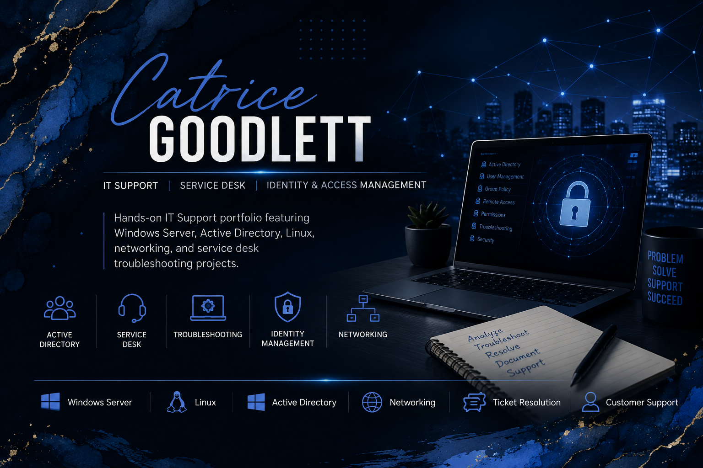

# Hi, I'm Catrice Goodlett 👋

IT Support | Service Desk | Identity & Access Management

Hands-on IT Support portfolio featuring Windows Server, Active Directory, Linux, networking, and service desk troubleshooting projects.

## 📝 About Me

I recently earned an Associate of Science in Cybersecurity & Networking and am actively pursuing my first IT Support opportunity. My portfolio showcases hands-on labs in Windows Server, Active Directory, Linux, and Help Desk support.

---

## 🚀 Featured Projects

🪪 <a href="https://github.com/CatriceG-cyber/IAM-Department-Transfer">IAM Department Transfer</a> 
🔑 <a href="https://github.com/CatriceG-cyber/Service-Desk-Password-Reset">Service Desk Password Reset</a> 
🖨️ <a href="https://github.com/CatriceG-cyber/Service-Desk-Ticket-Printer-Offline">Office-Wide Printer Outage</a> 
🐧 <a href="https://github.com/CatriceG-cyber/Kali-Linux-Shared-Folder-Configuration">Kali Linux Shared Folder Configuration</a> 
🏢 <a href="https://github.com/CatriceG-cyber/Basic-Employee-Onboarding-AD-RBAC">Active Directory Employee Onboarding</a>

---

## 🛠 Technical Experience

### Operating Systems

💻 Windows 10/11 
🖥️ Windows Server 2019 
🐧 Kali Linux 
🔐 Active Directory 
🌐 DNS 
🎫 Ticket Documentation 

---

### Identity & Access Management

🔐 Active Directory
👤 User Provisioning
🛡️ RBAC
🔑 Password Management
👥 Group Management

---

### Networking

🌐 DNS
📡 DHCP
🔒 VPN
📁 Shared Drives
🔗 TCP/IP Fundamentals

---

### Service Desk

🎫 Ticket Documentation
🛠️ Troubleshooting
🚨 Incident Resolution
🤝 Customer Support
🔍 Root Cause Analysis

---

### Tools

💻 VirtualBox
🌿 Git
🐙 GitHub
📊 Microsoft Office
🎥 Loom

---

## 🎓 Education

**Associate of Science – Cybersecurity & Networking**  
Long Beach City College

---

## 📫 Connect With Me

I'm always open to connecting with IT professionals, recruiters, and others in the tech community.

